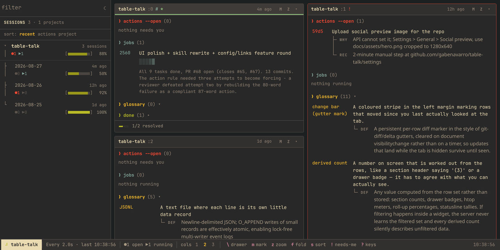
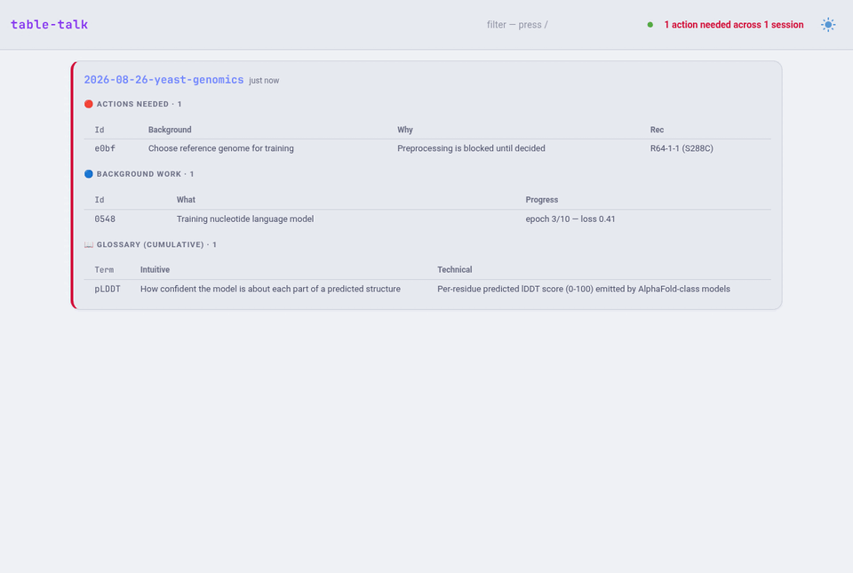

# table-talk

Structured collaboration between you and Claude: every Claude reply ends with
three tables — decisions it needs from you, background work in flight, and
technical terms explained twice (intuitive + precise). Everything is also an
event in a local log, and a live dashboard shows every session's tables with
the full cumulative glossary.

## How it works

- **CLI** (`bin/table-talk`, Python stdlib, zero deps): appends events to
  `~/.local/share/table-talk/<date>-<project>.jsonl`. Current state is a
  shallow-merge fold by 4-hex id — append-only, safe for concurrent sessions.
- **Dashboard** (`bin/table-talk-dash.py`, [NiceGUI](https://nicegui.io) via
  `uv run`, PEP 723): `table-talk serve` → http://127.0.0.1:8731 — one card
  per session, sortable tables, refreshes every 2 s, done items collapsed.
- **Skill** (`skill/SKILL.md`): tells Claude to record as it works and to end
  every reply with the tables, using ids you can reference back ("a3f9: option 2").

## Install

Requires Python ≥3.12, [uv](https://docs.astral.sh/uv/) (dashboard only), and
Claude Code (skill).

    git clone https://github.com/gabenavarro/table-talk.git
    cd table-talk && ./install.sh

install.sh symlinks the CLI into ~/.local/bin — make sure that's on your PATH.

## Use

    # each recording command prints a 4-hex id; capture it to update or close the item
    id=$(table-talk action "Choose ref genome" --why "blocks training" --rec "R64-1-1")
    tid=$(table-talk task "Training GPN model")
    table-talk progress "$tid" "epoch 3/10"
    table-talk done "$id"
    table-talk term "FVA" --intuitive "range of possible flux" --technical "LP min/max per reaction at fixed optimum"
    table-talk show            # plain-text dump
    table-talk serve           # dashboard

## Test

    ./test.sh
