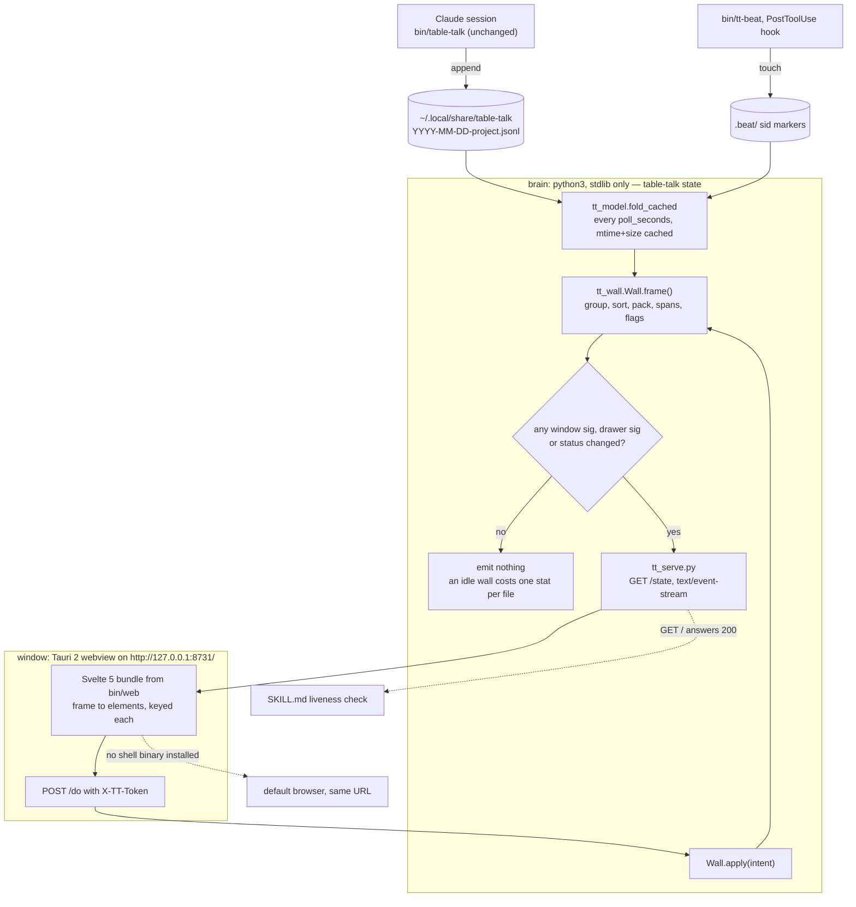

# Svelte GUI for table-talk — design

**Status:** proposal, 2026-09-08. Nothing is built. This document exists to be
approved, section by section, before any code is written.
**Scope:** replace `bin/table-talk-dash.py` (3257 lines of NiceGUI) with a
Svelte 5 front end and give table-talk its own window.
**Not in scope, and not negotiable:** the JSONL log format, `bin/table-talk`'s
CLI surface, and `skill/SKILL.md`. Claude sessions keep writing through the CLI
exactly as they do today, and `curl -sf "$(table-talk url)"` keeps answering 200
(SKILL.md:222 hard-codes that liveness check).

---

## 1. Why

**What a native GUI buys.** The dashboard is the only part of table-talk that is
not table-talk's own. It needs `uv`, which fetches its own interpreter and two
wheels (`nicegui>=3.16`, `claude-agent-sdk>=0.2`) on first run; it renders through
uvicorn and a websocket; and it lives in a browser tab that competes with forty
others for the user's attention. Underneath that, NiceGUI's render model is
clear-and-rebuild: the wall calls `container.clear()` every two seconds, which is
why `REPLY_JS` has to save and restore a textarea's value *and caret* through a
`requestAnimationFrame`-throttled `MutationObserver`, why `BLUR_JS` has to blur a
button on a real mouse click but never on a synthetic one, why the tab title is
maintained by a regex over rendered DOM text, and why the wall has to carry a
hand-written per-window paint signature so that repainting one card does not
repaint thirty. That is roughly 200 lines of injected JavaScript and a page of
signature bookkeeping, all of it defending against a render loop a Svelte keyed
`{#each}` does not have. A window of its own also gets the product an icon, a
title, no URL bar, no stray tab, and a repaint that follows a keystroke in about
five milliseconds instead of waiting up to two seconds for the next poll.

**What it costs.** Everything above is a rewrite of a UI that already works, and
the current one is good: three thousand lines that have learned the hard way that
a per-row `├` glyph breaks when `why` wraps, that a hyphen anywhere in a mermaid
`%%{init}%%` directive silently blanks the whole value, that `int` must read
before `why`, that a "copied" flash must fire only inside `writeText().then()`,
and that a watermark must advance by `int(now) - 1` because the CLI stamps `ts` in
whole seconds. A rewrite pays for every one of those lessons a second time unless
it is designed specifically not to — which is the single strongest constraint on
everything below. The other cost is a build step: a Svelte front end means Node in
the maintainer's loop and, for a real window, a Rust toolchain at build time and
a per-platform binary at release time. Neither is a runtime dependency, but both
are new things that can rot. Against that, the migration removes `uv`, NiceGUI,
`claude-agent-sdk`, and the whole injected-JavaScript layer from the runtime; the
net line count across the repo goes down.

---

## 2. Approaches considered

Three designs were written independently against the same reading (`reads/ui.md`,
`reads/gpuix.md`, `reads/landscape.md`) and scored by three judges on fit to the
brief, risk, effort, completeness and ponytail discipline.

### 2.1 `native` — gpuix-svelte *is* the GUI

1. One Node process, one real GPUI window drawn on the GPU, no webview, no HTTP.
2. `tt_model.py` is ported to TypeScript (`gui/model.ts`, ~620 lines) plus a
   ~700-line port of its selftest, kept honest by committed cross-language fixtures.
3. `tt_config.py` stays Python, reached by spawning `bin/tt_config.py --json` / `--set`.
4. `gpuix-svelte` is vendored as a tarball (it bundles a private build of an
   unmerged Svelte PR); `@gpuix/native` pinned at exactly 0.7.0.
5. `table-talk serve` (NiceGUI) is never deleted — it is the permanent kill-switch.

| judge | fit | risk | effort | completeness | ponytail | total |
|---|---|---|---|---|---|---|
| 1 | 6 | 2 | 2 | 8 | 2 | 20 |
| 2 | 7 | 2 | 2 | 7 | 3 | 21 |
| 3 | 9 | 2 | 2 | 8 | 3 | 24 |
| **sum** | | | | | | **65**, zero votes |

**Trade-offs.** It is the most literal answer to the brief and the only one that
is genuinely GPU-drawn. It is also the only one that maintains two implementations
of the log-format contract forever, and its own author prices that port at ~9 of
its 39 engineer-days and names the lazier alternative (keep Python as the model,
stream it) as the highest-value change in the document. The foundations are
pre-release in three layers: Svelte's custom-renderer API is PR #18511, unmerged
and force-pushed about weekly; GPUI is pre-1.0 with its Linux backend mid-rewrite
from Blade to wgpu; `@gpuix/native` is a third-party 0.7.0 binding. The
disqualifying facts for this repo are narrower and harder: `hasTestGpuixRenderer()`
is `false` on Linux and `new TestGpuixRenderer()` throws by design, so the entire
rendering half of the product would ship with no automated verification on the
maintainer's own machine; there is no clipboard API at all (copy-id shells out to
`wl-copy`/`xclip`/`xsel`, none guaranteed installed); there is no DOM or canvas, so
mermaid becomes source text plus an `open ▸` button; and `@font-face` is refused at
compile time in a UI made of `● ▶ ⏸ ◉ ❯ ▾ ▸ █ ░ ▓ ▉` and box-drawing.

### 2.2 `web` — Svelte 5 SPA + stdlib Python SSE server, in the browser

1. One process: `bin/tt_web.py`, `http.server.ThreadingHTTPServer`, stdlib only.
2. `tt_model.py` and `tt_config.py` are imported unchanged — no port, ever.
3. A poll thread folds the data dir every 2 s, builds one snapshot dict, hashes it,
   and pushes it to every open `/events` connection when the hash changes.
4. A Svelte 5 SPA (~1400 lines) renders the snapshot; four POST routes carry writes.
5. Runtime dependencies: `python3 >= 3.11` and a browser. No native phase is scheduled.

| judge | fit | risk | effort | completeness | ponytail | total |
|---|---|---|---|---|---|---|
| 1 | 3 | 9 | 9 | 9 | 9 | 39 |
| 2 | 3 | 10 | 10 | 9 | 10 | 42 |
| 3 | 3 | 9 | 9 | 9 | 9 | 38 |
| **sum** | | | | | | **119**, two votes |

**Trade-offs.** Engineering-wise this is the strongest of the three and it won the
vote: zero duplicated logic, zero runtime toolchain, 10–14 days, and every pin in
`tt_model.selftest()` / `tt_config.selftest()` still running against the same code
the GUI uses. Its deletions are correct regardless of front end — `REPLY_JS`,
`BLUR_JS`, `TAB_TITLE_JS`, `TOAST_JS`, `WIDTH_JS`, the paint signatures, the
`NICEGUI_STORAGE_PATH` import-order hazard, and `marked()`'s HTML escaping all stop
existing. It also fails the stated goal on purpose and says so: "this is not a
native window in phase 1–5, it opens in the user's browser… that is what
`table-talk serve` already does today." Its native phase is gated on three upstream
conditions and "may never happen". Its own honest section concedes that ~30% of
`tt.css` is deliberately *not* written to a GPUI-portable subset because doing so
would be worse code for a phase that may never come — which is the right call, and
also an admission that the portable-subset framing bought nothing.

### 2.3 `shell` — Python brain + Svelte view + a thin Tauri 2 window

1. The brain is Python: `bin/tt_wall.py` builds a fully-resolved *frame* (rows
   already split into spans, flags computed, columns already packed) from
   `tt_model` output; `bin/tt_serve.py` serves it over stdlib HTTP + SSE.
2. `tt_model.py` and `tt_config.py` are not edited. No fold, pack, `art_spans` or
   `path_spans` in TypeScript, ever.
3. The Svelte 5 view maps frames onto elements and posts *intents* back; a frame is
   pushed on the tick **and** immediately after any intent.
4. The window is ~120 lines of Rust: a Tauri 2 `WebviewWindowBuilder` pointed at
   `http://127.0.0.1:8731/`. It is optional; with no binary installed the same URL
   opens in the default browser.
5. It argues against gpuix-svelte explicitly and by citation, and keeps `GET /`
   open so SKILL.md's `curl` liveness check keeps working.

| judge | fit | risk | effort | completeness | ponytail | total |
|---|---|---|---|---|---|---|
| 1 | 9 | 7 | 6 | 9 | 8 | 39 |
| 2 | 8 | 8 | 6 | 10 | 7 | 39 |
| 3 | 7 | 7 | 5 | 9 | 6 | 34 |
| **sum** | | | | | | **112**, one vote |

**Trade-offs.** It delivers a real window — icon, title, no URL bar, no browser
tab — for one extra phase on top of what `web` ships, and it keeps mermaid,
`tt.css` and `navigator.clipboard` verbatim because a webview has a DOM. It is the
only design that reads SKILL.md closely enough to find the hard-coded liveness
check and design around it rather than special-casing it away, and the only one
whose front end a headless browser can drive in CI on both Linux and macOS. It
costs more than `web`: a Rust toolchain at build time, a per-platform binary at
release time, WebKitGTK-versus-Chromium CSS risk on Linux, and a token-gated HTTP
surface. Its weakest edges are a race-prone startup ("poll `GET /` for up to 10 s,
then decide whether to start a brain") and a frame-skipping scheme that its own
example frame defeats by shipping rendered `"age":"3m"` and a live clock.

### Recommendation

**Build `shell`.** It is not the top-scoring design and the recommendation has to
answer that. Two things settle it.

First, `web` and `shell` are the same design for their first four phases. Both keep
Python as the model, both serve a snapshot over stdlib SSE, both render it with
Svelte 5, both delete the same injected JavaScript. They differ in one 120-line
Rust file and in whether that file is scheduled or indefinitely gated. Both judges
who voted for `web` wrote a graft saying that if a native shell is ever built it
should be a thin Tauri window around exactly that server — which is `shell`'s last
phase, written down. The vote is a vote against gpuix's risk, not against a window.

Second, the maintainer asked to explore making table-talk its own GUI. `web`
declines that question and ships a second, better browser tab; the honest reading
is that it answers a different brief. `shell` answers this one and keeps `web`'s
answer as its own fallback: with no shell binary installed, `table-talk gui` opens
the same URL in the browser, so the browser product is not a phase that was skipped,
it is the floor.

**Not gpuix-svelte.** The brief named it; the reading disqualified it, and the
disqualification is specific rather than temperamental: no headless render test on
Linux (verified: `hasTestGpuixRenderer()` → `false`), no clipboard API, no DOM for
mermaid, `@media`/`::before`/`steps()`/negative `animation-delay` all refused by the
style compiler, and a vendored build of an unmerged Svelte PR force-pushed weekly.
Section 5 keeps the revisit conditions as an open question rather than burying them.

**What is grafted into `shell` from the other two.**

| from | graft | why |
|---|---|---|
| `native` | A cheap, disposable **phase 0 gate** — a day spent rendering the real `tt.css`, the real glyph set and a real mermaid diagram in Epiphany (WebKitGTK) on Fedora and in Safari (WKWebView) on macOS, *before* phase 3 starts. Allowed to fail; if it fails, drop the Tauri phase and ship `web`. | `shell`'s largest unknown is the Linux webview, and it is answerable in a day. |
| `native` | A **`.ui/gui.lock`** instance lock (`O_CREAT\|O_EXCL`, pid inside, stale pid reclaimed) instead of "poll `GET /` for 10 s, then decide". | Removes a real window where two `table-talk gui` launches both see the port unbound and both try to bind it. |
| `native` | The **honest per-platform coverage table** — verified and documented, not asserted, the way `native` caught the missing `darwin-x64` prebuild by reading a `.d.ts` instead of trusting docs. | "macOS works" is a non-negotiable; it has to be checked, on named versions. |
| `native` | **Committed golden fixtures**: `tt_wall.py --dump-fixtures` writes `tests/frames.json` from `docs/demo` at a fixed clock, asserted in the selftest and diffed in CI. | Makes the frame contract regression-proof rather than spot-checked. |
| `web` | **Absolute timestamps only in the frame**, with a selftest asserting the payload carries no `ago`-shaped key or value; `ago`/`hm`/the clock/`live_delay` render client-side. | `shell`'s frame skipping is worthless if a live clock or a rendered `"3m"` changes the payload every second. This graft is what makes the skip real. |
| `web` | A **line-by-line "diff of zero" audit** in the PR description naming exactly which existing CSS and behaviour is untouched. | Makes "nothing about mermaid or `tt.css` had to be re-derived" independently checkable. |
| `web` | The CI pattern `git diff --exit-code` guarding a committed build output, applied to `bin/web/` **and** to the Tauri binary's generated metadata against `shell/src-tauri/tauri.conf.json`. | A release build cannot silently diverge from its source between tags. |

---

## 3. The chosen design

### 3.1 Architecture

Two processes, one URL. Python owns the model and the view state; the front end
owns pixels, drafts and scroll offsets.



**Who reads the JSONL.** Only Python. `tt_model.fold_cached` over every `*.jsonl`
in `DATA_DIR`, exactly as `poll()` does today, with the same `(mtime, size)` cache.
The front end never opens a file in the data dir and never receives a path it can
act on except as an opaque `target` string that the brain re-resolves at click time.

**Who owns what.**

| state | owner | lifetime |
|---|---|---|
| folded model (`states`, `groups`, `wall_states`) | brain, rebuilt per tick | process |
| shared view state — `marks`, `folds`, `groups_folded`, `zoomed`, `scope`, `needs_me`, `current`, `cols`, `sort`, `drawer_open`, `merged`, `seen`, theme mode | brain, one `Store` | persisted in `.ui/wall.json` |
| per-viewer state — `seen_at`, `opened_ts`, `touched`, `wall_width`, `query`, per-window section toggles | brain, one `Wall` **per SSE connection** | connection |
| textarea drafts, scroll offsets, rendered relative times | the view | window/tab |

The per-connection `Wall` is the exact analogue of today's NiceGUI
closure-per-client: two open windows get independent watermarks and independent
wall widths, and share marks, folds and scope. Nothing about that behaviour changes.

**How updates flow.** A frame is pushed on the poll tick and immediately after any
intent, so a keypress repaints in about five milliseconds rather than waiting up to
two seconds. That is free — the fold is already cached — and it is the one
user-visible improvement in the whole migration.

**Why HTTP and not a stdio bridge.** SKILL.md:222 requires a socket on
`server.port` that answers 200. Given that socket has to exist, a second stdio
protocol is a second thing to write, test and debug for no new capability. The
ladder stops at stdlib: `http.server` plus a `text/event-stream` generator is about
250 lines. It is also what makes the migration reversible (any browser is a client)
and the CI end-to-end test possible.

**Startup, and the lock.** `table-talk gui`:

```python
def cmd_gui(port=None, force=False):
    if (msg := serve_refusal(os.environ, force)):     # reused verbatim: gui never returns
        sys.exit(msg)
    url, owner = claim(port)          # .ui/gui.lock: O_CREAT|O_EXCL, "<pid>\n<port>\n"
    open_window(url)                  # TABLE_TALK_SHELL or which("table-talk-gui"), else webbrowser
    if owner:
        cmd_state(port)               # this process becomes the brain; releases the lock on exit
```

`claim()` writes pid and port into `DATA_DIR/.ui/gui.lock` with `O_CREAT|O_EXCL`.
On `FileExistsError` it reads the file: if that pid is alive (`os.kill(pid, 0)`),
a brain is already running and this invocation only opens a window on it; if the
pid is dead the lock is stale, it is unlinked and the claim retried once. The lock
lives beside the data, so `TABLE_TALK_DIR=docs/demo table-talk gui --port 8899`
gets its own lock and runs beside a real instance exactly as today. The shell binary
still retries the URL until the brain binds, but it no longer *decides* anything:
exactly one process holds the lock and binds the port.

`table-talk serve` keeps its name and meaning. Through phases 0–5 it still execs
`table-talk-dash.py` under `uv`; in phase 6 its body becomes `cmd_state` and `uv`
leaves the repo. `table-talk url` is unchanged.

### 3.2 Components

**Python (new files, stdlib only, each with a `--selftest`).**

`bin/tt_wall.py` (~650 lines) — the brain's view layer, lifted out of `poll()`,
`do()` and the row builders with every `ui.*` call removed.

* `Store` — the `app.storage.general` replacement: a dict plus an atomic
  `os.replace` write of `.ui/wall.json`, debounced to at most one write a second.
  Same key set; the `tt.` prefix is dropped because it existed to share a namespace
  with NiceGUI.
* `Wall(store, cfg)` — one per connection. Holds `seen_at`, `opened_ts`, `touched`,
  `wall_width`, `query`, `sections`. Methods: `apply(intent)`, `frame(now, states)`.
* `frame()` — does exactly what `poll()` does today up to the point where it would
  touch an element: group → sort → `apply_fold_rules` → merge or flat → visible →
  `cols_for` → `layout_key` → `pack`, then serialises. Every helper `ui.md` lists as
  portable moves here verbatim: `tally_text`, `blocks`, `bar_for`, `_dim`/`_hits`,
  `next_sort`, `abbrev`, `default_cols`, `cols_for`, `layout_key`, `changed_ids`,
  `link_roots`, `link_spans`, `open_rows`/`done_rows`/`term_rows`/`diagram_rows`,
  `form_updates`, `coerce`, `theme_css`, `nearest_claude_md`, `transcripts`,
  `live_sessions`.
* `KEYMAP` — the same dict, still the single source for keys *and* chips.
* `--dump-fixtures` — renders frames for `docs/demo` at a fixed clock into
  `tests/frames.json`.

`bin/tt_serve.py` (~250 lines) — `ThreadingHTTPServer` + `BaseHTTPRequestHandler`.
Static files out of `bin/web/` by a five-name whitelist (never a path join on the
request), `/state` SSE, `/do` POST. Owns the token, the `Origin` check, the SIGINT
shutdown, the lock file, and the in-place rebind when `server.port` changes on disk.

**Svelte (`ui/`, Svelte 5 + Vite, build time only; output committed to `bin/web/`).**

| unit | what it does | used by | depends on |
|---|---|---|---|
| `src/frame.svelte.js` | `EventSource('/state')` into a `$state frame`; `send(intent)` = `fetch('/do', {headers:{'X-TT-Token'}})`; reconnect backoff 0.5→8 s; exposes `stale` | everything | — |
| `src/fmt.js` | the only client-side logic: `ago(ts, now)`, `hm(ts)`, `live_delay(read_ts, now)`, and the 1 s clock tick. Pure, no imports, unit-tested with `node --test` | Window, Row, Statusline | — |
| `src/App.svelte` | the `.tt-main` grid (drawer + wall) and the statusline; `keydown` → `{do:'key',k}` unless the target is an input, textarea or button or a dialog is open; click/keydown/scroll/`visibilitychange` → `{do:'touch'}` at most once a second; `ResizeObserver` on `.wall` → `{do:'width'}` only when the clamp flips | root | frame |
| `src/Wall.svelte` | renders `frame.wall.columns` (`string[][]`, already packed) as N `.col` divs of `<Window>`; the three empty-wall messages from `frame.wall.empty` | App | Window |
| `src/Window.svelte` | the `.win` card: titlebar (project, `ix` button, age, `! # M Z * ◉` flags, M/Z/▾ buttons) and a body of `<Section>`; click anywhere → `{do:'current'}` | Wall | Section |
| `src/Section.svelte` | `❯ title (n) ▾/▸` button; open → rows, shut → the `█░` glyph bar; `sec.forced` overrides the user toggle for one render | Window | Row |
| `src/Row.svelte` | one component, `{#if row.kind}` over action / task / term / diagram / done; renders `row.cells` in the order the frame gives them | Section | Spans, Meter, Reply, Diagram |
| `src/Spans.svelte` | `{#each spans as [text, kind]}` → `<span class={kind}>`; kinds `''`, `st` (art structure), `tt-hit` (query match), `lnk` (clickable, carries `target`). **Never `{@html}`** | Row | frame |
| `src/Meter.svelte` | blocked banner ⏸, `.scan` sweep, or the `blocks()` glyph bar + pct + `as of HH:MM`, with `animation-delay` computed by `fmt.live_delay` | Row | fmt, tt.css |
| `src/Reply.svelte` | `<textarea>` bound to a module-level `Map<id,string>` plus a copy button (`navigator.clipboard.writeText(row.copy).then(flash)`) | Row | — |
| `src/Diagram.svelte` | `mermaid.render(id, src)` → `{@html svg}`. The **only** `@html` in the app; CI greps for exactly one. A render failure lands in a *separate* `error` state rendered as `{error}` — mermaid's own SVG is the only string that ever reaches `{@html}`, because mermaid quotes the offending source back in its error text and that source came out of a log file | Row | mermaid.min.js |
| `src/Drawer.svelte` | the expanded tree (filter input, hit count, theme toggle, `sort:` row, projects and sessions with `meter_row`) and the 54 px rail; footer links from `frame.drawer.ctx` | App | frame |
| `src/Statusline.svelte` | the spinner glyph the brain sends, cadence, tally, scope chip, `cols 1 2 3`, one chip per `frame.status.keymap` entry, live clock; toast `$effect` on a rising open count; `document.title = "(N) table-talk"` | App | frame, fmt |
| `src/Settings.svelte` | dialog built from `frame.settings.fields` (`tt_config.form_fields()`); save → `{do:'config', set:{…}}` | Drawer | frame |
| `src/Keys.svelte` | the `?` dialog, from `frame.status.keymap` | App | frame |

**Shell.** `shell/src-tauri/src/main.rs` (~120 lines): a `WebviewWindowBuilder` at
the URL in `argv[1]`, title `table-talk`, minimum 900×600, size and position
remembered by `tauri-plugin-window-state`. Two extra behaviours: retry the URL until
the brain answers (10 s), and a `page_load` handler that re-navigates if the webview
lands on an error page. No IPC, no commands, no sidecar, no injected JS. Builds to
`table-talk-gui`. This shell bundles **no** frontend at all — every window is a
`WebviewUrl::External` — so `tauri.conf.json`'s `frontendDist` names the loopback URL
rather than a directory: `tauri_build::build()` and `generate_context!()` resolve and
validate a *local* `frontendDist` at compile time, and pointing one at a directory
nothing in the repo creates fails the build with "Unable to find your web assets".

### 3.3 Data flow

```
*.jsonl  ──tt_model.fold_cached──►  states{stem: {id: ev}}
                                     │
   group_sessions ─ sort_groups ─ apply_fold_rules ─ merge_projects
                                     │
   weight ─ pack(visible, cols, weights, marks)  ──► columns[[key]]
                                     │
   per row: art_spans, link_spans, parts(q)      ──► spans[[text, kind]]
   per row: progress_pct, blocked_by, blocks()   ──► meter (pct, cells, read_ts)
   per window: changed_ids, live_sessions, transcripts ──► flags
                                     │
                       json.dumps(frame) ──SSE──► Svelte $state ──► elements
                                     │
   client only: ago()/hm()/clock from absolute ts, draft text, scroll offsets
```

Frame shape, abridged. `v` is bumped on any incompatible change and the view
refuses a version it does not know, showing "update table-talk".

```json
{"v":1,"t":1757337600.4,"polls_ok":412,"stale":false,
 "wall":{"cols":2,"columns":[["gpn-yeast"],["table-talk"]],"empty":null},
 "windows":{"gpn-yeast":{
   "sig":"9f3c…","project":"gpn-yeast","sid":"4f2a","tx":"/home/…/4f2a….jsonl",
   "latest":1757337421,
   "flags":{"bell":true,"actv":false,"mark":false,"zoom":false,"cur":true,"beat":true},
   "sections":[{"id":"act","title":"actions --open","n":2,"open":true,
                "forced":false,"bar":null,"rows":[
     {"kind":"action","id":"a1b2","copy":"SESSION: 4f2a - ID: a1b2",
      "ts":1757337421,"changed":"act","cursor":true,"reply":true,
      "cells":[{"c":"title","spans":[["Pick a fold cadence",""]]},
               {"c":"int","spans":[["how often the wall re-reads the logs",""]]},
               {"c":"why","spans":[…]},{"c":"rec","spans":[…]},
               {"c":"art","lines":[[["┌──","st"],[" alpha ",""],["──┐","st"]]]}]}]}]}},
 "drawer":{"open":true,"sig":"41ba…","sort":"recent","hits":"4/61 rows match",
           "projects":[…],"ctx":[…]},
 "status":{"spin":"⠹","tally":{"open":3,"running":1,"blocked":1},
           "poll_seconds":2.0,"last_ok":1757337600.4,
           "scope":null,"cols":2,"keymap":{"m":{"label":"mark","on":false},…}},
 "theme":{"mode":"dark"},
 "settings":{"fields":[…]}}
```

**No rendered relative time anywhere in the frame.** `latest`, `ts`, `read_ts`,
`last_ok` and `t` are absolute; the view renders `ago()`, `hm()` and the clock from
them on its own 1 s interval. Two reasons, both load-bearing: a rendered `"3m"` or a
live clock would change the payload every tick and make frame skipping worthless,
and a client-rendered relative time stays honest on a card that has not repainted
for an hour. `as of HH:MM` stays absolute because it is the right label for a
reading, not because anything forces it. A selftest asserts the serialised frame
carries no key matching `ago|since|_ago` and no value matching `\d+[smhd] ago`.

**Polling stays.** The brain re-globs `DATA_DIR` and `fold_cached`s every tick;
`fold_cached` re-parses only on an mtime or size change, which is why today's 2 s
loop is free and why it stays free. `server.poll_seconds` keeps its 0.2–∞
validation and its meaning. No `inotify`, no watchdog: the directory holds a handful
of append-only files, and a watcher would need a debounce back to about 2 s anyway
to avoid repainting mid-write.

**Frame skipping.** Python already computes a per-window paint signature. It ships
as `windows[k].sig`; the connection keeps the previous frame's signatures, and if
every window sig, the drawer sig and the status numbers are unchanged, **the tick
emits nothing**. An idle wall costs one `stat()` per file per 2 s and zero bytes on
the wire. Only windows currently on the wall carry `sections`; off-wall windows ship
flags only, so a data dir with forty sessions and a two-column wall sends two
windows' worth of rows. When a frame is emitted it is always complete — no deltas,
no patch protocol.

### 3.4 Feature parity

Every line of `reads/ui.md` §1, in its order. "Python, unchanged" means the function
is neither moved nor edited.

| feature (ui.md §1) | how the chosen design delivers it |
|---|---|
| **Wall structure, packing, columns** | |
| One window per session (flat) / per project (merged) | `tt_model.merge_projects`, Python unchanged; `u` toggles |
| Greedy pack into N columns, marked windows first | `tt_model.pack`, Python unchanged; the frame ships `columns` |
| Columns 1/2/3 auto from width; the stored pref is a **maximum**; a wall <900 px always packs 1 | `cols_for`/`default_cols` move to `tt_wall` verbatim, fed by `{do:'width'}` |
| Wall width reported by the client | `ResizeObserver` on `.wall` → `{do:'width'}`, firing only when the narrow/wide clamp flips. Deliberately not `matchMedia` on the viewport: collapsing the drawer changes the wall's width with no viewport change, and would miss a clamp flip |
| Content-derived window weight, never measured pixels | `tt_model.weight`, Python unchanged |
| Re-pack only when `layout_key` changes | `tt_wall` keeps `layout`; an unchanged `columns` list means Svelte's keyed `{#each}` moves no node |
| Zoom forces 1 column and one window | brain, from `store.zoomed` |
| Three distinct empty-wall messages | `frame.wall.empty` ∈ `needs_me` / `scope` / `nothing` |
| The filter query can never empty the wall | the brain dims, never filters; `_dim`/`_hits` move verbatim |
| **Window titlebar flags** | |
| `!` bell, blinking `steps(2,start)` | `flags.bell` + `.bell` in `tt.css`, **CSS unchanged** |
| `#` activity, `M` marked, `Z` zoomed | frame flags |
| `*` current, `--sel` tint, `--caret` underline | `flags.cur`; `target()`'s fallback (last clicked if still on the wall, else the first) moves to `tt_wall` |
| `◉` beat, applied per poll and outside the paint signature | `live_sessions` in `tt_wall`, written to `flags.beat` after the sig is computed |
| Titlebar: project, `ix` transcript button, age, M/Z/▾ with tooltips | frame fields; age from `fmt.ago(latest, now)`; `ix` click → `{do:'open', target: win.tx}`; tooltips are `title` attributes |
| Clicking anywhere in a window makes it current | `{do:'current', key}` |
| A window with open actions carries the `win-hot` border tint | `flags.bell` also drives the card's `win-hot` class, the way `dress()` does today |
| Window footer on every card: the `▰▱` obligation cells and `N/M resolved · all clear` | `resolved_cells` moves to `tt_wall` beside `bar_for`; `window_for` ships `footer` for every window on the wall (a folded one keeps it — `tt.css` hides only `.win-b`); `Window.svelte` renders `.win-f` > `.cells`, **CSS unchanged** |
| **Sections and collapse bars** | |
| Five sections in fixed order; diagrams only when ≥1 exists | `frame.windows[k].sections` — the brain decides the order |
| `❯ title (n) ▾/▸` clickable header | `Section.svelte`; `{do:'section', key, sec, open}` |
| Per-window open/shut surviving rebuilds | per-connection server state, the same lifetime `container.tt_open` has today |
| `ui.collapsed_sections` decides which start shut | `tt_config`, unchanged |
| `(█ open, ░ resolved)` glyph bar when shut, scaled to `MAX_CELLS=20`, gone when open | `sec.bar` from `bar_for` |
| A query hit force-opens a shut section for that render only, without touching the toggle | `sec.forced`; the issue #57 pin moves to `tt_wall.selftest` |
| **Row anatomy** | |
| Action row: id, title, `▉` cursor on the single newest open action wall-wide, `int` **first**, `why`, `rec`, art, reply | the `cells` array order is computed by the brain and pinned by a frame assertion — a stronger pin than dash.py's AST call-count check |
| Task row: id, what, meter, `int`, art, reply | same |
| Term row: term as the id cell, intuitive as title, `def` sub-row | same; no gutter, no reply |
| Diagram row: title as the id cell, live mermaid body | `Diagram.svelte` |
| Done row: id still clickable and copyable, title, art, reply | same |
| Sub-row tree guide as ONE continuous CSS rule with a corner, not per-row glyphs | `tt.css` `.sub::before`/`::after` **unchanged**, including the `margin-top` / `bottom:-Npx` bridge the dash selftest pins |
| id button showing the id plus a smaller `sid`/`_from` line | frame `id` + `sid` |
| **ASCII sketch** | |
| Two-ink structure/label split | `tt_model.art_spans`, Python unchanged; the frame carries `cells[].lines` as `[[text, kind]]` |
| `.art` full-width panel, `.art-in` inline-block centring, own `overflow-x`, `white-space:pre` | `tt.css` unchanged |
| Rendered as text, never markup | `Spans.svelte` emits text nodes; Svelte escapes them structurally |
| Drawn on action, task **and** done rows | pinned as frame content (an `art` cell wherever `diagram` is set) rather than as a call count |
| **Progress bar, pulse, read_ts** | |
| `progress_pct`: explicit `--pct` beats scraped text, bool rejected | `tt_model.progress_pct`, Python unchanged |
| `blocks(pct, 14)` cell snapping, no tween | `blocks` moves to `tt_wall`; the frame ships `meter.cells` |
| Pulse via a **negative** `animation-delay` equal to the reading's age, so a bar finishes with no repaint; stale or future → not live | CSS animation unchanged; the delay is computed by `fmt.live_delay(read_ts, now)` in the view, from the absolute `read_ts` in the frame |
| `as of HH:MM`, absolute | `fmt.hm(read_ts)` |
| Indeterminate 5-cell `.scan` sweep with staggered delays | `meter.kind = "scan"`; CSS unchanged |
| **Blocked-on** | |
| Derived from `blocked_by`, never stored, checked across **every** session file | `tt_model.blocked_by` + `open_action_ids`, Python unchanged |
| Blocked banner replaces the bar entirely | `meter.kind = "blocked"` |
| Counted separately in the tally; answering a blocker repaints the blocked task | `open_acts` stays inside the per-window signature |
| **Reply box** | |
| Under action, task **and** done rows | pinned as `reply:true` on those three kinds |
| Draft **and caret** survive the 2 s refresh | free: a keyed `{#each rows as row (row.id)}` never destroys the textarea. `REPLY_JS`'s `MutationObserver`, rAF throttle, caret save/restore and mousedown escape hatch are **deleted, not ported** |
| A draft survives a row leaving and re-entering the wall | drafts live in a module-level `Map<id,string>` |
| Copy `"<id>: <answer>"`, id guarded by `^[0-9a-f]{4,}$`, flash only on a resolved promise | `row.copy` is minted in Python and only present when the id matches, so the guard moves to the producer; the flash stays inside `.then()` |
| **Change gutters and watermarks** | |
| `changed_ids` per window against a per-window watermark; terms never gutter | `changed_ids` moves to `tt_wall`, unchanged |
| Watermark floored at page open, frozen while a window is off the wall | per-connection `seen_at` / `opened_ts`, same rules |
| Advanced only by interaction (click/keydown/scroll), `visibilitychange` secondary | four `addEventListener`s in `App.svelte` sending `{do:'touch'}` at most once a second — `SEEN_JS`'s trigger set, unchanged reasoning about a covered-but-not-backgrounded monitor |
| Advance uses `int(now) - 1` | unchanged, pinned |
| Not persisted; two windows independent | the connection dies, the `Wall` dies |
| `.row.changed` vs `.row.changed-job` colours | `tt.css` unchanged |
| **Drawer** | |
| 284 px expanded / 54 px rail, `\` toggle, `drawer_open` persisted | `Drawer.svelte` + `tt.css` unchanged |
| Filter input, hit count, theme toggle, `sort:` cycler, session tree | `frame.drawer` |
| Header `sessions` + `n · k projects` | frame |
| Per-project fold triangle only when >1 session | same rule, in `tt_wall` |
| `meter_row`: ● and ▶ badges greyed at zero, `[####    ]NN%` htop meter | from `tt_model.roll_up` counts. The meter is `dash.py`'s own markup — `.mtr` with literal `[`/`]` labels around the `.trk` CSS bar, then `.pc` — so `tt.css` is unchanged and the frame ships only `open`, `tasks` and `pct`. No glyph cells: this is the one bar in the app that was never text |
| Click a row to scope, click again to clear, ✕ chip clears, triangle folds without scoping | intents `{do:'scope'}` / `{do:'group_fold'}` |
| Sessions nested under an unfolded project; click jumps the wall to that window | `{do:'focus', key}`; the brain answers with `frame.focus`, and `Wall.svelte` `scrollIntoView`s once |
| Collapsed rail: `abbrev()` tag, `●n`, thin bar, same scope target | `abbrev` moves to `tt_wall` |
| Auto-fold on first-ever sight with zero open actions, persisted in `seen` | `apply_fold_rules` moves verbatim |
| A **rising edge** in open actions force-reopens a manually folded project | same comparison against `store.seen` |
| Context footer: nearest `CLAUDE.md` (never above `$HOME`, symlinks refused), `~/.claude/CLAUDE.md`, `MEMORY.md`, ⚙ settings, the raw settings path, the refreshed `config.example.toml`; absent when nothing exists | `nearest_claude_md` and the footer builder move verbatim; `frame.drawer.ctx` |
| Filter debounced by `ui.filter_debounce_ms` | a `setTimeout` in `Drawer.svelte`, then `{do:'query', q}`. The `.props()` injection hazard the config key was defending against does not exist here — there is no props string to interpolate into |
| Filter dims (`.tt-dim{opacity:.78}`), highlights `.tt-hit`, never hides; `N/M rows match`; scroll first hit into view, or back to top on clear | `tt_model.parts` runs in Python and ships `tt-hit` spans. Highlighting costs one loopback round trip per debounce interval (~5 ms, since an intent pushes a frame immediately) and buys the deletion of a second `parts()` in JavaScript |
| **Statusline** | |
| Spinner advancing one frame per **successful** poll only | `frame.status.spin`, advanced by the brain only on a clean tick and shipped as the **glyph** rather than an index — the ten-glyph sequence stays a Python tuple that nothing else keeps a copy of |
| `Every Ns · last HH:MM:SS` | `poll_seconds` + `fmt.hm(last_ok)` |
| Tally `●N open ▶M running ⏸K blocked`, blocked subtracted from running, counted across every session regardless of scope or zoom, `all clear` when empty | `tally_text`'s logic moves to `tt_wall`, shipped as three integers |
| Scope segment + ✕ | `frame.status.scope` |
| `cols 1 2 3` with the effective count highlighted (zoom shows 1) | `frame.status.cols` |
| One chip per `KEYMAP` entry except `filter`/`unzoom`; `.on` for needs-me and merge | `frame.status.keymap` — the same dict that dispatches keys, so a key and a click cannot diverge |
| Live clock | `fmt`, 1 s interval, client-side |
| Tab title `(N) ` prefix | a `$effect` on `tally.open`; no `MutationObserver` over rendered text. In the Tauri window it is also the window title |
| Toast on a **rise** only, against a baseline read at the first frame, 5 s dismiss | a `$effect` with the same baseline discipline, so a reconnect never bursts |
| Port-mismatch segment + restart button | **Argued cut, replaced.** `restart_offer`, `port_free`, `do_restart`, `RESTART_KEYS`, `needs_restart` and the `os.execv` all exist because `main()` reads config once at startup. The brain re-stats the config every tick already: when `server.port` changes it closes the listener and binds the new one in place, and the view re-navigates. If the new port is taken the bind fails, the old listener is kept, and the statusline says so — the same information the offer carried, without a button, a socket probe or a process replacement. The message is **not** sticky: every config reload clears it before deciding, so it says what is true now rather than what was true once — `restart_offer` recomputes itself every poll today and the replacement has to as well |
| **Keys** | |
| `\ m z f s / ! u ? Escape`, all with a click equivalent | `KEYMAP` in `tt_wall`, shipped in the frame, used for both chips and the `?` dialog |
| Keys ignored while an input, select, button or textarea has focus, or a dialog is open, or on key repeat | `event.repeat` + `target.closest("input,textarea,select,button")` |
| The NiceGUI button-focus workaround (`BLUR_JS`, `e.detail>=1`) | **Cut.** It existed because NiceGUI's keyboard layer swallows keystrokes while a button holds focus. An ordinary `window` keydown listener has nothing to work around, so a focused button and a working `m` key coexist and the keyboard user's focus ring is never thrown to `<body>` |
| **Merged vs flat** | |
| `u` toggles merged/flat, persisted, default from `cfg.ui.view` | brain |
| Merged: one window per project with `_from` tags; higher `ts` wins on an id collision (#140) | `tt_model.merge_projects`, Python unchanged |
| The drawer always lists real session files regardless of wall mode | the frame ships both `drawer.projects` and `wall.columns` |
| Clicking a drawer session while merged resolves to the project key before scrolling | `M.parse_stem(key)[1]` in `tt_wall`, pinned |
| **Zoom / fold / mark** | |
| All three persisted; one zoom at a time; a scope change clears zoom | brain, same rules |
| A folded window renders as titlebar-only and costs the packer weight 1 | brain |
| A marked window packs first, with a caret border and inset shadow | `tt_model.pack` + `tt.css`, both unchanged |
| **Transcripts** | |
| `transcripts()` scans **every** `~/.claude/projects/*/*.jsonl` each poll; an ambiguous 4-char prefix is dropped entirely | moves to `tt_wall` verbatim |
| The `ix` button opens the resolved transcript with that one path added to `extra_roots` for that one call | `{do:'open', target}`; the brain re-derives confinement at click time |
| **Links and `open_command`** | |
| `url_spans` http(s) only, punctuation trimmed | `tt_model.url_spans`, Python unchanged |
| `path_spans` links only a path resolving to an existing **file** inside a root | `tt_model.path_spans`, Python unchanged |
| Roots resolved once at start (data dir + cwd + `links.extra_roots`) | `link_roots` moves to `tt_wall` |
| A click re-derives confinement from scratch, launches an argv **list**, never `shell=True` | this is the whole reason opening stays a Python intent instead of a JS or Rust spawn; the AST ban on any `shell=` keyword moves to `tt_serve.selftest` |
| `links.open_command` (`open` / `xdg-open`); a failed launch warns and never crashes | unchanged |
| **Copy-id format** | |
| `SESSION: <sid> - ID: <id>` or the bare id, guarded, flash only on success | minted in Python as `row.copy`, copied verbatim. Only action, task and done rows carry it: `dash.py` renders a term's and a diagram's id cell as a plain label, never through `_id_button`, so `row_for` forces `copy: None` for those two kinds. The hex guard alone would not do it — every id the CLI mints is `secrets.token_hex(2)`, which always passes |
| **Mermaid** | |
| `securityLevel:"strict"` restated, `theme:"base"`, per-render `%%{init}%%` with the app's mono stack and `fontSize:"12px"` | `Diagram.svelte`, `MERMAID_INIT` copied verbatim |
| **No hyphen** anywhere in the init directive | copied verbatim and pinned; the sanitiser regex is `^[\d "#%(),.;A-Za-z]+$` and one bad character blanks the whole value |
| Colours from `tt.css` `!important` overrides keyed on the app's own tokens (`.mmd .node rect`, `.edgeLabel`, `.marker`, `rect.actor`, `text.actor>tspan`, `.noteText>tspan`, `.note`, `.labelBox`), with no blanket `.mmd text{}` rule | `tt.css` unchanged — this is the single largest reason the window is a webview |
| A parse error is handled client-side and never reaches the server | `mermaid.render()`'s rejection is caught and its message rendered as **escaped text** in a separate `error` state, not through `{@html}`: mermaid quotes the offending source back in that message, and the source is a log line. Same visible outcome as today — the row says why it could not draw — with the one sanctioned `{@html}` sink fed by mermaid's SVG and nothing else |
| **Settings** | |
| Fields derived entirely from `tt_config.form_fields()`, colour tokens excluded | `frame.settings.fields`; still no second hardcoded list |
| Save writes only changed keys, through `coerce` and `set_keys` line surgery, comments preserved | `form_updates` and `coerce` move to `tt_wall`; `tt_config.set_keys` unchanged |
| `ensure_config()` copies the commented example, never rewrites the user's file, refreshes the reference copy each start | moves to `tt_serve` verbatim |
| The restart message | `needs_restart` returns `[]`; the message is "saved", except for `server.port`, where it names the port it moved to |
| Config mtime polled cheaply, re-loaded only on change | same tick, unchanged |
| **Themes** | |
| Mode toggle `◐/○/●` cycling system→light→dark, persisted | `frame.theme.mode`; applied as a class on `<html>` plus a `matchMedia('(prefers-color-scheme: dark)')` listener for `system` — the browser answers the question the server cannot |
| 15 bundled palettes, `adapted` records, `theme.dark_theme`/`light_theme` | `tt_config.themes()`, unchanged |
| `[theme.dark]`/`[theme.light]` overrides layered on top of a named theme | `tt_config.load`, unchanged |
| WCAG contrast floors enforced against every bundled theme | `tt_config.selftest`, unchanged |
| `--hover` derived from `--surface`, never configurable | `tt.css` unchanged |
| `theme_css` emits only differing tokens and re-validates every value as hex on the way out, iterating the DEFAULTS key set | moves to `tt_wall` unchanged and is served as `/themes.css`; its cross-check against `bin/tt.css` stays pointed at `bin/tt.css`, which does not move |
| **UI-state persistence** | |
| The thirteen keys in `app.storage.general` | `.ui/wall.json`, atomic `os.replace`, same key set |
| Storage lands beside the **data**, not the launch directory | `DATA_DIR/.ui/`. The `NICEGUI_STORAGE_PATH`-before-import hazard and its AST-order pin disappear by construction: there is no import-time path binding |
| `wall_width`, `seen_at`, `opened_ts`, `touched` explicitly not persisted | unchanged, per connection |
| Two viewers share marks and folds, keep independent watermarks and widths | one `Store`, one `Wall` per connection |
| **The 2 s poll and the paint guard** | |
| One bad poll degrades the statusline, never kills the timer | the SSE loop catches; the spinner freezes and the cadence chip goes `.sl-stale`; the connection stays open |
| The clock is read **before** the file reads each tick | same line order |
| A per-window guard so one unrenderable row costs one card | a per-window try/except around frame *building*; that window is emitted as `{"error":"could not build window"}` and rendered as a card with one line |
| The signature is recorded only **after** a successful build | unchanged, pinned |
| The drawer's analogous signature | `drawer.sig`, same rule |
| **Heartbeat** | |
| `bin/tt-beat`, `.beat/<sid>`, `BEAT_WINDOW=120`, future mtime never live, missing hook silent | `live_sessions` moves verbatim; `tt-beat`, `tt-ref` and `install-hook` are untouched |
| **The demo dir** | |
| `TABLE_TALK_DIR=docs/demo` beside a real instance on another port | same env var, same mechanism; it also becomes the fixture for `--dump-fixtures` and the CI end-to-end test |
| **Jobs** | |
| The jobs section (open tasks), the `#` flag, the blocked banner | preserved: they render from the frame like any other section, and were never the runner |
| Starting a job from the wall (`start_job`) | **Already removed.** `start_job` lived in `dash.py`, not in `tt_jobs.py`, and since #201 removed the job modal nothing in the UI called it — its only other reference was dash.py's own selftest. #226 deleted it along with `bin/tt_jobs.py` and the `claude-agent-sdk` dependency, ahead of this migration. See Q3 below |

### 3.5 Error handling

| failure | behaviour |
|---|---|
| A bad JSONL line (garbage, bad UTF-8, missing or non-numeric `ts`, a lone surrogate) | `tt_model.fold` tolerates each per line without raising. Unchanged, and its pins still run |
| An unreadable file, a directory named `*.jsonl`, a chmod-000 log | `fold` returns `{}` per its existing pins. Unchanged |
| A file vanishes between the glob and the read | `fold_cached` catches `OSError` → `{}`; the window leaves `frame.windows` on the next tick and the keyed `{#each}` removes the card. If it was zoomed, the existing "zoomed key not in windows" rule clears the zoom |
| One row cannot be serialised | the per-window try/except renders that card as one error line; the rest of the wall is unaffected; the sig is not recorded, so the next tick retries |
| A whole tick raises | caught in the SSE loop: the spinner freezes, the cadence chip goes `.sl-stale`, the connection stays open. Same degraded-not-dead contract as `tick()` today |
| The brain dies (crash, SIGKILL, port stolen) | `EventSource.onerror` → a `stale` banner, "brain not responding — reconnecting"; backoff 0.5→8 s, forever. The last frame stays on screen; nothing blanks |
| The window is closed | the brain keeps running; it is a server. Re-running `table-talk gui` finds the lock held by a live pid and opens a new window on the same brain |
| A brain is already running when `gui` starts | `.ui/gui.lock` holds a live pid → skip starting a second brain, open a window on the port in the lock |
| A stale lock (the brain was SIGKILLed) | the pid in the lock is dead → unlink and claim it once. If the claim races and loses, fall back to opening a window on the lock's port |
| The port is in use at startup | `bind` fails → the lock is released and the process exits with `error: port 8731 is in use — another table-talk is running: <url>` |
| `server.port` changes on disk while running | the listener is closed and rebound in place. The serving loop re-reads the brain's *current* listener after every `serve_forever()` return, so shutting the old one down hands control to the new one instead of ending the process — the whole point of preferring this to `os.execv`, and the one way to get it wrong. The lock file is rewritten with the new port, so a later `table-talk gui` opens a window where the brain actually is. On a failed bind the old listener is kept and the statusline says the new port is taken |
| No shell binary installed | `webbrowser.open(url)`. The GUI is never unavailable |
| Node missing | irrelevant at runtime — `bin/web/` is committed. Only `ui/build.sh` needs Node ≥20; it says so and exits 2 |
| Rust missing | only `shell/build.sh` needs it; `table-talk gui` falls back to the browser |
| `bin/web/index.html` missing (a clean checkout mid-rebase) | the brain exits before binding: `error: bin/web not built — run ui/build.sh (needs node >= 20), or use table-talk serve --legacy` |
| `open_command` not installed | `Popen` raises `FileNotFoundError` → the brain answers 200 with `{"warn":"xdg-open not found"}` and the statusline shows it. Never crashes |
| A hostile payload to `/do` (`javascript:`, `..`, a symlink escaping a root, shell metacharacters in a filename) | confinement is re-derived server-side from scratch, the scheme allowlist is `http`/`https`, the launch is an argv list, and an AST scan bans any `shell=` keyword anywhere in `tt_serve.py` |
| A cross-origin POST from a page in the user's browser | rejected: `X-TT-Token` is missing (a cross-origin page cannot read `index.html` to learn it) and `Origin` is not the configured origin |
| A static-file request for `../../etc/passwd` | 404 — the handler serves a five-name whitelist and never joins a request path |
| The config becomes malformed while running | `tt_config.load` returns DEFAULTS plus a warning (existing behaviour); the statusline shows "config not readable, using defaults" |
| The clipboard is denied, or the page is reached over a LAN IP (an insecure context) | the "copied" flash never fires, because it lives inside `writeText().then()`. Same limitation as today; `http://127.0.0.1` and `http://localhost` are secure contexts by spec |
| A viewer's browser or webview does not know the frame version | the view refuses an unknown `v` and shows "update table-talk" rather than rendering half a frame |

**Security stance, stated plainly.** The brain listens on `server.host` (a validated
choice, `127.0.0.1` by default — the "a typo never widens exposure" pin in
`tt_config.selftest` becomes more load-bearing, not less). `/do` can launch
processes, so it is token- and Origin-gated: 32 bytes from `secrets.token_urlsafe`,
minted per process, written to `.ui/token` mode 0600 and inlined into `index.html`.
`GET /` stays token-free so SKILL.md's `curl` check keeps working; it leaks only the
fact that table-talk is running. This is strictly better than today, where NiceGUI
accepts websocket events on 8731 with no token at all.

### 3.6 Testing

`./test.sh` stays a dependency-free bash script running Python selftests, and stays
green on Linux with nothing installed.

```sh
python3 bin/table-talk    --selftest    # unchanged
python3 bin/tt_model.py   --selftest    # unchanged — the file is not edited
python3 bin/tt_config.py  --selftest    # unchanged — the file is not edited
python3 bin/tt_wall.py    --selftest    # NEW
python3 bin/tt_serve.py   --selftest    # NEW
command -v node >/dev/null && node --test ui/test/ || echo "node absent - skipped ui/test"
uv run --script bin/table-talk-dash.py --selftest    # until phase 6 deletes it
```

**The `tt_model` pins are carried by not moving them.** There is no model port, so
`fold`, `percent`, `progress_pct`, `blocked_by`, `open_action_ids`, `summarize`,
`roll_up`, `group_sessions`, `merge_projects`, `sort_groups`, `weight`, `pack`,
`art_spans`, `row_text`, `parts`, `url_spans`, `path_spans`, `project_roots` and all
of their property-test cases keep running against exactly the same code the GUI
uses. Likewise `tt_config`: the 15 themes, the WCAG floors, `set_keys`' line surgery
and `form_fields()` are untouched, and the DEFAULTS-versus-stylesheet cross-check
still points at `bin/tt.css`, which does not move.

**`tt_wall.selftest()`** carries the pins that leave `dash.py`, restated as
**frame-content assertions** — strictly better than AST call-count pins, because they
assert the output rather than the shape of the code that produced it:

* the `int` cell precedes `why` and `rec` in every action row's `cells`;
* an `art` cell appears on action, task **and** done rows whenever `diagram` is set
  (the `_art_sub`-called-4× pin, as data);
* `reply:true` on action, task and done rows (the `_reply_sub`-called-3× pin);
* every `row.copy` matches `SESSION: [0-9a-f]{4,} - ID: [0-9a-f]{4,}` or `^[0-9a-f]{4,}$`, and is `None` on term and diagram rows **given a real, hex-valid minted id** — a synthetic non-hex id would pass the assertion without ever exercising the rule;
* every window on the wall carries a `footer`, folded ones included;
* **no relative time leaks**: the serialised frame contains no key matching
  `ago|since|_ago` and no value matching `\d+[smhd] ago`;
* **skip stability**: two `frame()` calls over unchanged files produce identical
  window signatures and an identical serialised payload;
* only windows on the wall carry `sections`; off-wall windows carry flags only;
* `tally_text` pieces, `bar_for` scaling to `MAX_CELLS=20`, `blocks(pct,14)`,
  `cols_for`'s narrow clamp beating the stored preference, `default_cols`
  thresholds, `layout_key` membership, `next_sort`'s cycle, `changed_ids` excluding
  terms, `abbrev`;
* the `_hits` rule force-opens a collapsed section without mutating the toggle (#57);
* `apply_fold_rules`: a first-ever-seen project folds once, and only a *rising edge*
  reopens a manually folded one;
* the watermark advances by `int(now)-1`, only when `touched`, and only for windows
  that were on the previous wall;
* `open_acts` is inside the window signature, `beat` is outside it;
* `form_updates` writes only changed keys; `coerce` returns `None` out of bounds.

**Golden fixtures.** `python3 bin/tt_wall.py --dump-fixtures` renders frames for
`docs/demo` at a fixed clock into `tests/frames.json`, committed. The selftest
asserts the current build reproduces that file byte for byte; CI runs the dump and
`git diff --exit-code -- tests/frames.json`. A frame change is then a reviewable
diff rather than a silent behaviour change.

**`tt_serve.selftest()`** pins the boundary, driving a real server on port 0 through
`http.client`: `GET /` returns 200 **with no token** (the SKILL.md:222 liveness
contract, named and asserted, not an incidental side effect); `/state` without a
valid token returns 403; `/do` with a foreign `Origin` returns 403; `/do` with a
path outside `link_roots` refuses and does not spawn; `/do` with `javascript:` or
`file://` refuses; an ambiguous 4-char transcript prefix refuses; a static request
for `../../etc/passwd` returns 404; the SSE framing is `data: <json>\n\n`; the lock
file round-trips (claim, stale reclaim, release); and the AST scan finds no `shell=`
keyword anywhere in the file.

It also drives the **port rebind end to end**, in a subprocess: start a real brain
against a temp config, hold one `/state` stream open (a tick only runs while
somebody is watching), rewrite `server.port` in the config file, and assert the new
port answers 200, the process is still alive, and `.ui/gui.lock` still names that
live pid and now names the new port. Calling `reload_config()` once in-process
proves nothing here — the bug this pins is that the *serving loop* mistakes a swap
for a shutdown, and only a running `serve_forever()` can show it.

**JavaScript, only where logic can break.** `node --test ui/test/fmt.test.mjs` over
`src/fmt.js`: `ago` boundaries, `hm` padding, `live_delay` returning null for a
stale or future reading and a negative number otherwise. About 25 assertions. No
vitest, no jsdom, no component-render framework — the components are declarative and
everything that can break lives in Python or in `fmt.js`.

**End to end, in CI only.** `ui/e2e.mjs` (~120 lines of Playwright; registration,
reporting and the exit code come from stdlib `node:test`, the same runner
`fmt.test.mjs` already uses — "no test framework" means no vitest and no jsdom, not
a hand-rolled loop with its own pass counter) spawns `TABLE_TALK_DIR=docs/demo python3 bin/table-talk state --port 8899`
and drives the page against the frozen demo dir: the tally text; two projects on the
wall; `!` hides the window with no open actions while the tally does **not** change;
`u` flips merged and flat; `\` collapses the drawer to 54 px; typing in the filter
dims rather than hides; a mermaid `<svg>` appears; and typing into a reply textarea
survives three poll cycles with its value and caret intact — the `REPLY_JS` contract,
tested rather than hand-defended — and survives its row being **destroyed and
rebuilt** (shut the section, reopen it), which is the only check that can tell a
module-scope draft map from a per-instance one; and a diagram source written to fail
mermaid's parser with `<script>` and `` in it puts no such tag in the
DOM. Screenshots on failure.

`.github/workflows/test.yml` gains two jobs; the existing `test` and
`cli-oldest-python` jobs are unchanged.

```yaml
  ui:
    runs-on: ubuntu-latest
    steps:
      - uses: actions/checkout@v4
      - uses: actions/setup-node@v4
        with: { node-version: "22" }
      - run: cd ui && npm ci && npm run build
      - run: git diff --exit-code -- bin/web        # the committed bundle matches its source
      - run: python3 bin/tt_wall.py --dump-fixtures
      - run: git diff --exit-code -- tests/frames.json
      - run: npx playwright install --with-deps chromium webkit
      - run: node ui/e2e.mjs --browser=chromium
      - run: node ui/e2e.mjs --browser=webkit      # the engine the Linux window actually uses

  ui-macos:
    runs-on: macos-14
    steps: [ …checkout, node, build, playwright install webkit, node ui/e2e.mjs --browser=webkit ]
```

Running the same script against Playwright's WebKit on Linux is the cheap, automated
half of the WebKitGTK risk; it is not identical to the distro's WebKitGTK build,
which is why phase 0 also checks the real thing by hand in Epiphany and Safari, and
why a release adds one manual Epiphany pass. The Tauri shell itself gets no unit
tests — it is a `WebviewWindowBuilder` and a URL — but the release workflow smoke-
builds it on both platforms and diffs the generated binary metadata (icon path,
version string, bundle identifier) against `shell/src-tauri/tauri.conf.json`, so a
tagged release cannot silently diverge from its config. That workflow is exercised
through `workflow_dispatch` on a branch, never by pushing a throwaway tag: a tag on
the shared remote is a public event with an Actions run and artifacts behind it, and
pushing one is the maintainer's call, not a plan step's. It needs only
`permissions: contents: read` until a job actually publishes a release.

### 3.7 Migration path

Every phase ends with a working product. `bin/table-talk-dash.py` is not edited by
any phase and stays launchable through phase 5; it is the kill-switch.

**Phase 0 — the webview gate (1 d).** Before anything is built: open the real
`bin/tt.css`, the real glyph set (`─│┌┘█░▓❯▾▸◉●▶⏸◐○●▉⚠✕⚙`), a real mermaid diagram
and a `steps(2,start)` blink plus a negative-`animation-delay` bar in **Epiphany
(WebKitGTK) on Fedora/Wayland** and in **Safari (WKWebView) on macOS**. Check that
`navigator.clipboard.writeText` resolves in both. The gate is served over
`http://127.0.0.1` from `python3 -m http.server`, never opened as `file://`: the
shipped app is a loopback HTTP origin, loopback is a secure context by spec, and
`file://` is not — testing the clipboard there would answer a question about an
origin the product never uses, in either direction. This phase is cheap and its whole
purpose is to be allowed to fail: if `tt.css` does not render correctly in WebKitGTK,
drop the Tauri phase, ship the browser product (`web`), and say so in the PR.

**Phase 1 — the frame (4 d).** Add `bin/tt_wall.py` with `Store`, `Wall`, `KEYMAP`,
`frame()` and `--dump-fixtures`; copy the portable helpers out of `dash.py`.
Add `table-talk state --once`, which prints one frame to stdout. `dash.py` is not
edited. **Ships:** a documented JSON state dump, useful on its own —
`table-talk state --once | jq .status.tally`.

**Phase 2 — the server (2 d).** Add `bin/tt_serve.py`: `table-talk state` becomes a
long-running server with `/`, `/state`, `/do`, the token, the `Origin` check and the
`.ui/gui.lock`, plus a bare `index.html` that dumps the frame as text.
**Ships:** a second, ugly, fully live view on port 8899, with the real dashboard
still on 8731.

**Phase 3 — the Svelte app (12–15 d).** `ui/` with Vite, the components above, built
into `bin/web/`. Work section by section against the demo dir: wall and windows →
rows, spans and art → drawer → statusline and keys → mermaid → settings and themes →
watermarks and drafts. **Ships at every step:**
`TABLE_TALK_DIR=docs/demo table-talk state --port 8899` is a real, improving
dashboard the whole time.

**Phase 4 — parity and CI (3 d).** Walk §3.4 line by line against the running app
with both dashboards open on two ports. Write `ui/e2e.mjs`, add the `ui` and
`ui-macos` jobs, the committed-bundle diff and the fixtures diff. `table-talk serve`
grows `--legacy`, which still starts NiceGUI. **Ships:** two dashboards at parity,
the new one on the configured port.

**Phase 5 — the window (4 d).** `shell/src-tauri`, `table-talk gui`, and a release
workflow building `table-talk-gui` for `x86_64-unknown-linux-gnu` and
`universal-apple-darwin`. Fill in the platform coverage table in §3.9 with what was
actually verified. **Ships:** one command opens a native window.

**Phase 6 — deletion (2 d, one release later).** Remove `bin/table-talk-dash.py`
(3257 lines), `serve --legacy`, `tt_model.marked` (the HTML wrapper; `parts` stays),
the NiceGUI-specific rules in `bin/tt.css`, the `uv` line from `test.sh` and the
`astral-sh/setup-uv` step from CI (`bin/tt_jobs.py` and `claude-agent-sdk` are
already gone, deleted by #226). `table-talk serve` becomes an alias for
`table-talk state`. Net line count across the repo goes **down**.

**Kill-switch, at every point.** Phases 1–5 add files and never edit `dash.py`, so
`table-talk serve` is always one command away. After phase 6 the kill-switch is the
previous release tag; the reason it can be retired is that the new GUI still answers
on the same URL in any browser, so the failure mode phase 6 could introduce is "the
window binary is broken", and the browser path covers that without NiceGUI.

### 3.8 Repo layout at the end

```
bin/table-talk            CHANGED  + `gui`, + `state`, + lock helpers,
                                   + a `shell=` ban in its selftest; `serve` repointed
bin/tt_model.py           unchanged
bin/tt_config.py          unchanged
bin/tt.css                CHANGED  NiceGUI-specific rules trimmed (~450 lines);
                                   still the file tt_config.selftest cross-checks
bin/themes.json           unchanged
bin/tt-beat, bin/tt-ref   unchanged
bin/tt_wall.py            NEW      ~650 lines, stdlib, --selftest, --dump-fixtures
bin/tt_serve.py           NEW      ~250 lines, stdlib, --selftest
bin/web/                  NEW      committed build output: index.html, app.js,
                                   app.css, tt.css, mermaid.min.js  (~1.5 MB,
                                   1.1 MB of it mermaid)
ui/                       NEW      Svelte 5 + Vite source (~1400 lines), build.sh,
                                   e2e.mjs, test/fmt.test.mjs   (build time only)
shell/src-tauri/          NEW      ~120 lines of Rust, tauri.conf.json, icons
shell/build.sh            NEW      cargo tauri build
tests/frames.json         NEW      golden frames from docs/demo at a fixed clock
skill/SKILL.md            unchanged  (non-negotiable)
install.sh                CHANGED  chmod targets (table-talk-dash.py leaves the
                                   chmod list in the SAME commit that deletes it:
                                   install.sh runs under `set -e`, so chmod on a
                                   missing path aborts the whole install);
                                   a note about the optional binary
test.sh                   CHANGED  six python3 selftests + optional node; no uv
docs/config.example.toml  CHANGED  the restart note removed
.github/workflows/test.yml CHANGED + ui, + ui-macos; setup-uv removed
.github/workflows/release.yml NEW  two-runner matrix building the shell binary
README.md                 CHANGED  Dashboard/Install/Themes sections; no uv, no NiceGUI
bin/table-talk-dash.py    DELETED  3257 lines
```

Commands: `table-talk gui` (new — opens the window), `table-talk state`
(`argparse.SUPPRESS`ed but fully invocable, so its long-running form goes through the
same `serve_refusal` guard as `serve` and `gui` — a Claude session that runs a
never-returning command wedges until its tool timeout; `--once` prints one frame and
returns, and needs no guard), `table-talk serve`
(same name, same meaning, now the brain), `table-talk url` (unchanged), everything
else unchanged. Runtime dependencies of the whole product: **`python3 >= 3.11` and a
webview or a browser**. No uv, no NiceGUI, no Node, no Bun, no Rust.

### 3.9 Distribution and install

**What a user installs.** `git clone && ./install.sh` — unchanged. It symlinks
`bin/table-talk` into `~/.local/bin`, links the skill, makes the data dir and offers
the heartbeat hook. That alone gives a working GUI: `table-talk gui` opens the
default browser. The native window is an optional extra — download `table-talk-gui`
from Releases into `~/.local/bin/`, or `cd shell && ./build.sh`.

**The Python floor moves from 3.10 to 3.11 for the GUI only.** `bin/table-talk`
keeps its 3.10 promise (no `tt_config` import at module scope, still covered by the
`cli-oldest-python` CI job). The brain needs `tomllib` via `tt_config`, so it needs
3.11. Today the dashboard sidesteps this because `uv` brings its own interpreter, so
a box with system Python 3.10 (Ubuntu 22.04, Debian 12 — both named in the README)
would lose the dashboard. Mitigation, three lines and no dependencies: `tt_serve.py`
keeps a PEP 723 header declaring `requires-python = ">=3.11"` and **no** dependencies,
so `uv run --script bin/tt_serve.py` still works there for anyone who wants it,
while plain `python3` works everywhere else. Documented in the README, not
discovered.

**Linux.** `cargo tauri build --target x86_64-unknown-linux-gnu` produces
`table-talk-gui` (~8 MB) plus a `.deb` and an `.AppImage` from the same run. The
binary needs `libwebkit2gtk-4.1` at runtime; the AppImage bundles it. Unsigned —
Linux has no signing expectation.

**macOS.** `cargo tauri build --target universal-apple-darwin` produces
`table-talk.app` (~10 MB) in a `.dmg`. Signed and notarized when the release workflow
has `APPLE_CERTIFICATE` / `APPLE_ID` / `APPLE_TEAM_ID` secrets, unsigned otherwise
with the right-click-Open path documented. WKWebView is part of the OS; nothing else
ships.

No cross-compilation: the release workflow is a two-runner matrix, `ubuntu-22.04`
(an older glibc, for wider compatibility) and `macos-14`.

**Platform coverage — the honest table.** This is filled in during phase 5 by
*checking*, not by asserting; `native`'s reading caught a missing `@gpuix/native`
prebuild by reading a `.d.ts` instead of trusting the docs, and the same discipline
applies here. Until a row says "verified", it is a claim.

| target | artifact | what must be verified in phase 5 | if it fails |
|---|---|---|---|
| Fedora 42+ / Wayland (the maintainer's box) | `table-talk-gui` | window opens, `tt.css` renders, clipboard round-trips, mermaid draws | blocking — the design assumes this works |
| Ubuntu 24.04 / Debian 13, x86_64 | `.deb` | installs, `libwebkit2gtk-4.1` resolves from the distro | ship the AppImage as the Linux default |
| Older/other Linux, x86_64 | `.AppImage` | runs on a glibc at least as old as the `ubuntu-22.04` runner's; name the exact version in the README | document the floor rather than implying "any Linux" |
| linux-arm64 | none built | whether anyone needs it | falls back to the browser; documented, not silent |
| macOS 14+, Apple Silicon | `.app` (universal) | opens, is signed or documents the right-click path | blocking — "macOS works" is non-negotiable |
| macOS 13 and Intel Macs | `.app` (universal) | that the universal build actually launches on both | falls back to the browser; documented |
| Windows | none | out of scope, as today (WSL only) | unchanged |

**Size, honestly:** an 8–10 MB shell binary plus a 1.5 MB committed web bundle
(1.1 MB of it mermaid) plus the existing ~250 KB of Python. Against `native`'s ~80 MB
per platform, and Electron's 120–200 MB.

### 3.10 Config and UI-state

**No config key is added, removed or re-typed.** Every key in `tt_config.DEFAULTS`
keeps its default, its type and its validation, and `tt_config.py` is not edited.
Three keys change owner without changing meaning: `server.host`, `server.port` and
`server.poll_seconds` now describe the brain rather than NiceGUI. `TABLE_TALK_DIR`
and `TABLE_TALK_CONFIG` work exactly as they do today, for the CLI and the GUI alike.

Files under `DATA_DIR/.ui/`:

| file | contents | written how |
|---|---|---|
| `wall.json` | the thirteen shared keys: `theme`, `marks`, `folds`, `groups_folded`, `zoomed`, `scope`, `needs_me`, `current`, `cols`, `sort`, `drawer_open`, `merged`, `seen` | atomic `os.replace`, debounced to at most one write a second |
| `token` | 32 bytes from `secrets.token_urlsafe`, minted per process | mode 0600, replaced on every start |
| `gui.lock` | `"<pid>\n<port>\n"` | `O_CREAT\|O_EXCL`, removed on exit, stale pid reclaimed |

Deliberately **not** persisted, for the same reasons as today: `wall_width` (a
property of a window, not a preference — two viewers at different widths must not
fight over the column count) and `seen_at` / `opened_ts` / `touched` (per-viewer
watermark state — "since you last looked", and opening the window *is* looking).

The `.ui/` directory already exists and already holds NiceGUI's store, so nothing
moves; the old `.ui/storage-general.json` is left alone by phases 1–5 and can be
deleted by hand after phase 6, exactly as the README already says about `.nicegui/`.

### 3.11 Risks and mitigations

| risk | mitigation |
|---|---|
| **WebKitGTK renders `tt.css` differently from Chromium** — the real Linux webview risk | `tt.css` is 2020-era CSS (flex, grid, custom properties, `::before`, `steps()`), but that is an argument, not evidence. Phase 0 checks the real stylesheet in Epiphany on Fedora and Safari on macOS **before** phase 3 starts, and is allowed to fail; CI then runs the whole end-to-end script against Playwright's WebKit on every PR. Fallback costs nothing: the browser path is always available |
| **The committed `bin/web/` drifts from `ui/`** | CI rebuilds and `git diff --exit-code -- bin/web`. A PR that edits `ui/` without rebuilding fails |
| **The frame quietly grows a rendered relative time and defeats frame skipping** | a selftest asserts the payload carries no `ago`-shaped key or value, plus a skip-stability assertion over unchanged files. It is a rule with a test, not a convention |
| **Frame size on a large data dir** | only windows on the wall carry `sections`; off-wall windows ship flags only, from the start. Frames are skipped entirely when nothing changed. If a real wall still bites, the next fix is dropping `done` rows and glossary bodies until their section is open — not a delta protocol |
| **Localhost CSRF: a page in the user's browser POSTing `/do`** | token **and** `Origin`, `.ui/token` at 0600, `server.host` a validated choice. Strictly better than today |
| **Two brains on one data dir** | `.ui/gui.lock` with a stale-pid reclaim; different ports by construction for the demo dir. A same-port collision fails loudly at bind |
| **Tauri's Rust toolchain becomes a maintenance tax** | it is 120 lines behind a build script in its own directory, needed only for the optional binary. Deleting `shell/` at any time leaves a working product |
| **Nobody can run the GUI on system Python 3.10** | a dependency-free PEP 723 header on `tt_serve.py` keeps `uv run --script` working there; the README names the floor |
| **A rewrite loses a subtlety the current dashboard learned the hard way** | §3.4 is the checklist and phase 4 is a dedicated sweep with both dashboards open. The costliest subtleties (`fold` edge cases, `pack` determinism, `art_spans` ranges, `path_spans` confinement, `set_keys` line surgery, the WCAG floors, every `tt.css` rule and the whole mermaid init) are **not rewritten at all** — that is the point of the design, and the PR description carries a line-by-line "diff of zero" audit so the claim is checkable |
| **The reply-draft contract regresses** | it becomes an end-to-end assertion (type, wait three polls, check value and caret), which it has never been — plus a second one that shuts and reopens the row's section, because the keyed `{#each}` makes the first check pass whether the draft map is module-scope or per-instance |
| **A log line reaches `{@html}` through an error path** | the one `{@html}` in the app is fed by a `$state` that only `mermaid.render()`'s *resolved* SVG is ever written to; the rejection path writes a different variable, rendered as `{error}`. CI greps for exactly one `@html`, and the e2e script feeds a diagram source built to fail the parser with markup in it |
| **Frame protocol churn during phase 3** | the `v` field, and a view that refuses an unknown version; both sides move in the same commit until phase 4 freezes `v:1` |
| **`http.server` is not a production server** | it does not need to be: loopback, one user, `ThreadingHTTPServer`, a handful of connections — the same posture as today's uvicorn on 8731 |
| **The window binary rots between releases** | the release workflow diffs the generated binary metadata against `tauri.conf.json`, smoke-builds on both platforms, and the browser fallback means a broken binary is an inconvenience, not an outage |

### 3.12 Effort by phase

One engineer who knows this codebase, including tests, docs and review.

| phase | days | what dominates |
|---|---|---|
| 0 — the webview gate | 1 | rendering `tt.css` and mermaid by hand in two real webviews |
| 1 — `tt_wall.py`, the frame, `state --once`, fixtures | 4 | lifting the row builders and the drawer out of `poll()` |
| 2 — `tt_serve.py`, SSE, token, lock, static | 2 | the boundary selftest |
| 3 — the Svelte app to parity | 12–15 | `Drawer` and `Row` are the dense ones; `tt.css` and mermaid come along unchanged |
| 4 — parity sweep, `e2e.mjs`, CI | 3 | the line-by-line walk of §3.4 |
| 5 — the Tauri shell, `table-talk gui`, release workflow | 4 | packaging and the coverage table |
| 6 — delete `dash.py`, docs, dependency removal | 2 | removing 3257 lines and two dependencies |
| **total** | **28–31** | |

Phase 3 is the estimate that can move; its floor assumes `tt.css` and mermaid come
along unchanged. The same design on gpuix-svelte is 45–60 days, untestable in CI on
Linux, on two unreleased foundations. The browser-only variant (stop after phase 4,
skip 0 and 5) is 21–25 days.

---

## 4. Non-goals and ponytail cuts

**Non-goals.** Sharing components with a web app. A plugin API. Multi-user or
remote access beyond what `server.host = "0.0.0.0"` already offers with its existing
"no password" warning. Windows (WSL, as today). Rendering the wall as multiple OS
windows — today's "wall of session windows" is a grid of CSS cards in one document,
and one window is all this app ever wanted. Offline packaging of Python.

**Cuts, each because the thing it solved stopped existing.**

1. **The TypeScript model port.** No `fold`, `pack`, `weight`, `art_spans`,
   `path_spans` in TypeScript. Python already has them, already tested, already the
   CLI's own contract. This is the single decision the rest of the design hangs off.
2. **gpuix-svelte and GPUI.** Two pre-release foundations, a vendored Svelte fork,
   no clipboard, no mermaid, no CSS engine, no Linux render tests, ~80 MB per
   platform — to draw text and rectangles. Prototype it for fun; do not ship on it.
3. **The stdio/NDJSON bridge.** SKILL.md forces an HTTP face to exist. One socket,
   two verbs.
4. **NiceGUI, uvicorn, websockets and `uv` from the runtime path.** `http.server`
   plus SSE is stdlib and one-directional, which is the shape of the data.
5. **`REPLY_JS`, `BLUR_JS`, `TAB_TITLE_JS`, `TOAST_JS`, `SEEN_JS`, `COPY_JS`,
   `WIDTH_JS`** — about 200 lines of injected JavaScript defending against
   clear-and-rebuild. A keyed `{#each}`, four `addEventListener`s and one
   `ResizeObserver` replace all of it.
6. **`tt_model.marked` and its HTML-escaping property test.** Svelte escapes text
   nodes structurally, so the bug cannot occur. `parts()` stays.
7. **`restart_offer`, `port_free`, `do_restart`, `RESTART_KEYS`, `needs_restart`,
   the `os.execv` and the `.sl-port` statusline segment.** Rebind the listener in
   place instead — strictly less code and no "exec onto a taken port ends the
   process" failure mode.
8. **The `.props()` AST injection ban.** There is no props string to interpolate
   into. The `shell=` ban is kept, because that vector still exists.
9. **The `NICEGUI_STORAGE_PATH`-before-import hazard and its AST-order pin.** A JSON
   file has no import-time class attribute to race.
10. **A delta or patch protocol.** Full frames, plus skip-when-unchanged. Add deltas
    when a profiler says so.
11. **A file watcher** (`inotify`, watchdog). A handful of append-only files and a
    2 s cadence that is already the product's documented behaviour.
12. **A state database.** One atomic `wall.json`.
13. **A component test framework** (vitest, jsdom, testing-library). Python
    selftests, one `node --test` file, one Playwright script.
14. **Rust beyond a window.** No commands, no IPC, no sidecar, no plugins except
    `window-state`.
15. **A second `parts()` in JavaScript.** Highlighting costs one loopback round trip
    per debounce interval instead of a duplicated function with its own pins.

`[frame protocol + ~900 lines of stdlib Python + a Svelte view + 120 lines of Rust]
→ skipped: a TS model port, deltas, gpuix, a sidecar, a state DB; add when Python
measurably falls short, which for folding a directory of small append-only text
files it will not.`

---

## 5. Open questions for the maintainer

Only the ones that change the design. Each has a default; silence takes the default.

**Q1. Is the window in scope, or do we stop at phase 4?** Two of three judges picked
the browser-only design on engineering grounds, and phases 1–4 ship exactly that
product. Phase 5 is 4 days and one 120-line Rust file for an icon, a title, no URL
bar and no stray tab.
*Default: build it, gated by phase 0.* If phase 0 finds WebKitGTK mangles `tt.css`,
phase 5 is dropped and the browser product is the answer.

**Q2. Does `table-talk serve` (NiceGUI) get deleted in phase 6, or kept?**
Keeping it costs 3257 lines, `uv`, two wheels and a CI step, and buys nothing the
new brain does not do — the new GUI answers on the same URL in any browser, over
SSH included.
*Default: delete it in phase 6, one release after parity.*

**Q3 — resolved.** "Start work from the wall" does not come back: the maintainer
chose to drop the runner before the public post, and #226 removed
`bin/tt_jobs.py`, `start_job`/`run_job`, their selftests and the
`claude-agent-sdk` dependency. The jobs *section* on the wall (task rows) is
unaffected. If the intent is ever wanted, the frame protocol makes it an
addition (`{do:'job'}`), not a refactor.

**Q4. Filter highlighting: server-side (one round trip per debounce) or a second
`parts()` in JavaScript (instant, duplicated logic)?** Over loopback with an
immediate push after every intent, the round trip is about 5 ms.
*Default: server-side, no duplicate.*

**Q5. Prebuilt binaries in GitHub Releases, or build-from-source only?** Releases
mean a two-runner workflow and, for a Gatekeeper-clean macOS download, an Apple
Developer certificate and notarization secrets.
*Default: publish unsigned Linux `.deb` and `.AppImage` and an unsigned macOS `.app`
with the right-click-Open path documented; add signing when a certificate exists.*

**Q6. Under what conditions do we revisit gpuix-svelte?** The rejection is
evidence-based and could expire.
*Default: revisit only when all three hold — sveltejs/svelte#18511 merged and in a
released Svelte, GPUI's Linux Blade→wgpu rewrite landed, and `TestGpuixRenderer`
working on Linux so CI can execute it. Until then it is a spike on a branch, and
nothing in phases 0–6 depends on it.*

---

## Feature roadmap (after parity)

Merged from the three feature brainstorms (workflow, presentation, integration)
against this design. Nineteen + eighteen + seventeen ideas, minus duplicates,
minus everything scoped to the gpuix-svelte renderer §2.1 rejected, minus
everything a real user would not reach for in a normal week, leaves **seven**:
two already scheduled inside parity, three worth building after it, two worth
building only if someone asks. Nothing here touches the JSONL format,
`bin/table-talk`'s CLI surface, or `skill/SKILL.md`. One item (#4) adds a new
*value* to an existing config key and is flagged where it lands.

| # | feature | value | cost | depends on | when |
|---|---|---|---|---|---|
| 1 | Native window identity — own icon, title, `(N)` open-count prefix, remembered size and position | high | S (already in phase 5) | Tauri `WebviewWindowBuilder` + `tauri-plugin-window-state` | **v1 parity** |
| 2 | In-app toast + title count on a **rising** open-action tally | high | S (already in phase 4) | `frame.status.tally`, baseline-then-rise discipline | **v1 parity** |
| 3 | Real OS notification on a rise while the window is unfocused; clicking it focuses the newest open action | high | S (~1 d) | #1, #2; `tauri-plugin-notification`, else spawn `notify-send`/`osascript` from the brain | **v1.1** |
| 4 | Open a linked path at its exact **line** in `$EDITOR` | high | M (~2 d) | `tt_model.path_spans` (unchanged); `links.open_command` gains an `"editor"` choice + a four-entry argv table | **v1.1** |
| 5 | Resident presence — tray/menu-bar icon carrying the tally, window close hides instead of quits, optional autostart | med-high | M (~3 d) | #3; `tauri-plugin-tray-icon`; one `systemd --user` unit + one `launchd` plist | later |
| 6 | Global hotkey that summons the wall from any app | med-high | M–L (~3 d, Wayland unknown) | `tauri-plugin-global-shortcut`; on Wayland the XDG desktop portal, verified before it is promised | later |
| 7 | Inline transcript tail under the `ix` button, opt-in and click-to-reveal | med | M (~3 d) | `transcripts()` (unchanged) + a seek-from-end line reader on the existing poll tick | later |

`S` ≤ 1 day, `M` 2–4 days, `L` 5+ — one engineer who knows this codebase, tests
and docs included, on top of the 28–31 days in §3.12.

**1. Native window identity.** This is not new work, it is the reason phase 5
exists, and it is listed so the parity sweep actually checks it rather than
shipping Tauri's defaults. The window carries table-talk's own icon and title,
holds its own Alt-Tab and Mission Control slot, and remembers its size and
position through `tauri-plugin-window-state`. The `(N) table-talk` prefix that
`TAB_TITLE_JS` maintains today by regexing rendered DOM text becomes a `$effect`
on `tally.open` that sets both the document title and the window title. All three
brainstorms ranked this "ship v1" independently and all three were right for the
same unexciting reason: it falls out of having a window at all. Worth naming once
so nobody counts it twice as a roadmap item.

**2. Rising-tally toast.** Also already parity, restated here because it is the
foundation #3 extends rather than replaces. The rule is the one `TOAST_JS`
learned: fire only when the open-action count rises against a baseline read at
the *first* frame, so a reconnect or a refresh never bursts a stack of toasts for
actions that were already there. The Svelte version is a `$effect` with the same
baseline discipline and a 5 s dismiss. If this rule regresses, #3 becomes an
alarm clock that goes off every time the SSE connection blinks.

**3. Real OS notification.** The in-app toast only exists while the window is
visible and rendering, which is precisely the case where nobody needs telling.
The whole product is "an action is waiting on you", so the one attention channel
worth adding is the one that works when table-talk is minimised, behind an
editor, or on another workspace: a genuine OS notification through the
notification centre, so it is still in the history after the coffee break.
Tauri's notification plugin is a one-line call and needs no permission dialog for
a locally-installed app; the fallback is the same guarded `spawn` idiom the
codebase already uses for `open_command` (`notify-send` on Linux,
`osascript -e 'display notification'` on macOS, silent if neither exists). The
click handler is what makes it a loop rather than an interruption: activating the
notification focuses the window and issues the `{do:'focus', key}` intent the
drawer already sends, landing on the newest open action. Everything here rides on
plumbing #2 already built — one number, one rising edge, now three surfaces.

**4. Open at the exact line in `$EDITOR`.** Today a linked path goes to
`xdg-open`/`open`, which routes through the OS file-association table and has no
concept of a line number — so `path_spans` drops a trailing `:LINE` entirely, a
limitation the current dashboard documents rather than fixes. For a person whose
day is reading a `why` field that names `bin/tt_wall.py:412` and then going
there, this is the most-used link in the app and it currently lands at the top of
the file. The fix is small and stays inside the existing security boundary: the
brain still re-derives confinement from scratch at click time, still launches an
argv **list**, still never uses `shell=True` (the AST ban in `tt_serve.selftest`
is unchanged); only the command built changes, from `[open_command, path]` to
`["code", "--goto", f"{path}:{n}"]` or `[$EDITOR, f"+{n}", path]`, with a
fallback to today's whole-file open when the editor is not in the four-entry
table (`code`, `zed`, `vim`/`nvim`, `emacs`). The line number is computed at
click time by scanning the file, never stored — exactly as confinement is, and
the reason this needs no log-format field. It is the one item on this roadmap
that touches config: `links.open_command` gains `"editor"` as a validated choice.
§3.10's "no config key is added, removed or re-typed" is a promise about the
*parity migration*; this is a post-parity feature adding one enum value to one
existing validator, and it should be argued in its own PR rather than smuggled in
under that sentence.

**5. Resident presence.** The brain already survives the window closing — it is a
server. What dies is every trace of table-talk on screen, which is the real gap
between "a dashboard" and "a thing that lives on your desktop": with no window
open there is nothing showing that three actions are waiting. A tray/menu-bar
icon carrying the same tally (`●N`, tinted for blocked) closes that, and it is
also what makes #3 honest — a notification you can act on when nothing is open.
The shape is ordinary: the Tauri shell keeps running with its window hidden
rather than exiting, the tray icon owns show/hide and quit, and an optional
`install.sh --autostart` writes one `systemd --user` unit or one `launchd` plist.
Two deliberate limits. It ships opt-in, because a process that keeps running
after you close its window is exactly the kind of thing that should require an
explicit yes. And Linux tray support is `StatusNotifierItem`, which GNOME still
needs an extension for — so this lands as "works on KDE and macOS, degrades to
nothing visible elsewhere", verified per desktop the way §3.9's coverage table is
filled in, or it does not land. That caveat is why it is `later` and not `v1.1`
despite being the highest-value item after #3.

**6. Global summon hotkey.** One key combination from inside any application
brings the wall to the front — the Spotlight/Raycast move, aimed at the moment
someone finishes a thought in their editor and wants to know what is waiting
without hunting a taskbar. All three brainstorms reached for it and one called it
the best idea on its list. It is `later` for one honest reason: on the
maintainer's own desktop (Fedora, Wayland) a global shortcut is not a hotkey
registration but an XDG desktop portal request, whose behaviour varies by
compositor and which may prompt the user or silently do nothing. macOS is
straightforward and prompts for Accessibility permission the first time. So this
is a two-day feature with a one-day spike in front of it, and the spike comes
first: build it only after `tauri-plugin-global-shortcut` is confirmed working on
Fedora/Wayland, and drop it rather than ship a key combination that works on one
of the two required platforms. The quick-capture-popup variant several
brainstorms proposed on top of it is cut below — summoning the wall and typing
into the reply box that is already there does the same job with no second window.

**7. Inline transcript tail.** The `ix` button hands the whole Claude Code
transcript to an external viewer, which is a context switch for the common
question, "what is this session actually doing right now?" The brain already
resolves the transcript path every poll (`transcripts()`, including its rule that
an ambiguous 4-char prefix is dropped entirely) and already runs a 2 s tick, so
the last few KB of that file can be read on the same tick with no new polling
loop and no new dependency — a seek-from-end-and-count-newlines reader is about
fifteen lines. It ranks last because it is the only feature here that *widens
what is shown* rather than changing how: a transcript carries full tool output,
meaning file contents and command output for anything the session touched. So it
ships collapsed and opt-in behind a reveal click, never open by default, unlike
every section beside it. The reason to build it at all: for someone watching
several agents at once, "is it stuck or is it working" is asked far more often
than any other question the wall cannot currently answer.

**Cut, and why.** Merged into the seven above: dock/taskbar badge count (#5's
tally, a third surface for a number already on two); quick-capture popup (#6 plus
the reply box that already exists); "zero-hop spawn for open-in-editor" (that is
#4; the latency claim was marginal, loopback is ~5 ms); "window is its own
Alt-Tab citizen" (#1). Cut on the brainstorms' own evidence: tray via GPUI,
multi-window wall, always-on-top HUD, background survival, OS-idle-aware
batching, `WindowOptions.fullscreen`, GPU tweens, `set_css_vars` theming, native
cursor shaping, GPU virtual-list scrolling — all scoped to the renderer §2.1
rejected, and either absent from its API or free in a webview. Cut as YAGNI:
**full-history search index** — `poll()` already folds *every* `*.jsonl` in
`DATA_DIR` each tick, so the drawer filter already searches all history and an
FTS5 index would index data already in memory; **deep-link
`table-talk://focus/<id>`** — nothing emits such a link and inventing an emitter
means touching the CLI; **timeline scrubber** — change gutters and watermarks
already answer "what moved since I looked"; **live theme-token editor** — theming
is a once-a-year task and the TOML is one click away; **drag-and-drop attach**,
**macOS Services menu**, **Spotlight importer**, **remote tray-only companion**,
**resizable split panes**, **macOS vibrancy** — none reached in a normal week, and
split panes would turn `pack()`'s pinned determinism into user-perturbable state
for a cosmetic win; **activate the live terminal from the `◉` flag** — Wayland
gives unprivileged clients no raise-that-window API, so it would no-op on the
maintainer's own desktop. Not a feature, kept as a contingency: if a real wall
ever scrolls badly, the next move is the one §3.11 already names — drop `done`
rows and glossary bodies from the frame until their section is open — not a
virtualisation library.
